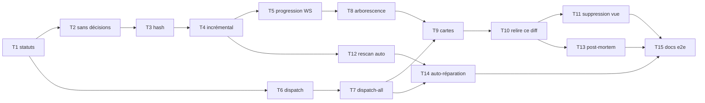

# Gardien en calque sur la vue Git — plan d'implémentation

> **Pour Claude :** SOUS-SKILL REQUIS : utiliser superpowers:executing-plans (ou superpowers:subagent-driven-development) pour exécuter ce plan tâche par tâche.
> **Exécutants prévus :** sub-agents **codex · gpt-5.6-terra · effort medium**. Chaque tâche est autoporteuse : chemins exacts, code clé fourni, aucun contexte préalable supposé. Une tâche = un commit.

**But :** supprimer la vue Gardien dédiée et faire vivre la review de risques comme un calque d'annotations actionnables sur la vue Git — scan 1 clic, zones colorées par sévérité, dispatch d'un agent par zone, rescan incrémental.

**Design de référence (à lire avant toute tâche) :** `docs/plans/2026-08-08-gardien-calque-git-design.md`

**Architecture :** le sidecar (Bun + SQLite, `sidecar/src/`) porte les données et le moteur de review (`reviews.ts`, `stores/reviews.ts`) ; l'UI (React 19 + Vite, `ui/src/`) n'a pas de framework UI — CSS maison dans `ui/src/styles/`. La communication est HTTP REST + WebSocket (`sidecar/src/server.ts`). Les tests « UI » sont des tests de logique exécutés côté sidecar (`sidecar/tests/ui-*.test.ts`).

**Stack de commandes :**
- Tests : `cd sidecar && bun test` (417 tests verts au départ) — ciblé : `bun test tests/reviews.test.ts`
- Typecheck : `cd sidecar && bun run typecheck` et `cd ui && bunx tsc --noEmit`
- Ne jamais utiliser `git rebase -i`. Committer après chaque tâche, messages en français, format `feat(gardien): …` / `fix: …`.

**Invariants à ne pas casser :**
- La validation stricte des flags (ancrage sur lignes réellement modifiées, `validateFlag` dans `sidecar/src/reviews.ts:606-648`) reste telle quelle.
- Le contre-avis (`startCounterOpinions`, `executeCounter`) reste fonctionnel à l'identique.
- L'acquittement automatique par test réussi (`sidecar/src/testing.ts:227`, `reviews.ackFlags`) doit continuer de fonctionner (renommé `treated`).
- `MAX_CONCURRENT_SUBTASKS = 4` (limite serveur des sous-tâches par conversation) n'est pas contournable.

---

## Phase 1 — Backend : données et statuts

### Tâche 1 : étendre le schéma des flags et des reviews

**Fichiers :**
- Modifier : `sidecar/src/db.ts` (bloc des `addColumn`, vers la ligne 282)
- Modifier : `sidecar/src/stores/reviews.ts` (types `ReviewFlagStatus`, `ReviewFlag`, `Review`)
- Test : `sidecar/tests/reviews.test.ts`

**Étape 1 — test qui échoue.** Ajouter dans `sidecar/tests/reviews.test.ts` un test qui crée une review complète (imiter le premier test du fichier), puis :

```ts
test("un flag porte les nouveaux statuts et champs de dispatch", () => {
  // …setup identique aux tests existants du fichier…
  const flag = store.listFlags(review.id)[0]!;
  expect(flag.status).toBe("open");
  expect(flag.hunk_hash).toBeNull();
  expect(flag.subtask_id).toBeNull();
  expect(flag.user_message).toBeNull();
  expect(store.setFlagStatus(flag.id, "treated")?.status).toBe("treated");
  expect(store.setFlagStatus(flag.id, "agent_running")?.status).toBe("agent_running");
  expect(store.setFlagStatus(flag.id, "resolved")?.status).toBe("resolved");
  expect(store.setFlagStatus(flag.id, "ignored")?.status).toBe("ignored");
});
```

**Étape 2 —** `bun test tests/reviews.test.ts` → FAIL (colonnes/statuts inconnus).

**Étape 3 — implémentation.**
Dans `sidecar/src/db.ts`, après les `addColumn` existants de `review_flags` (~l.282) :

```ts
addColumn(db, "review_flags", "hunk_hash TEXT NULL");
addColumn(db, "review_flags", "subtask_id TEXT NULL");
addColumn(db, "review_flags", "user_message TEXT NULL");
addColumn(db, "reviews", "scope TEXT NOT NULL DEFAULT 'worktree'");
addColumn(db, "reviews", "parent_review_id TEXT NULL");
// Migration de vocabulaire : « acquitté/écarté » devient « traité/ignoré ».
db.exec(`UPDATE review_flags SET status = 'treated' WHERE status = 'acked'`);
db.exec(`UPDATE review_flags SET status = 'ignored' WHERE status = 'dismissed'`);
```

Dans `sidecar/src/stores/reviews.ts` : `ReviewFlagStatus = "open" | "countered" | "agent_running" | "treated" | "ignored" | "resolved"` ; remplacer partout `'acked'` → `'treated'` et `'dismissed'` → `'ignored'` (notamment `ackFlags` l.153 et `gardienStatus` l.310-344 : un flag « ouvert » = statut `open`, `countered` ou `agent_running`). Ajouter `hunk_hash`, `subtask_id`, `user_message` au type `ReviewFlag` et aux champs acceptés par `updateFlag`.

**Étape 4 —** `bun test tests/reviews.test.ts` → PASS. `bun test` complet : corriger les tests existants qui utilisent `acked`/`dismissed` (chercher : `grep -rn "acked\|dismissed" sidecar/tests/ sidecar/src/ ui/src/`). Côté serveur, `PATCH /api/review-flags/:id` (`sidecar/src/server.ts:2181` env.) accepte les nouveaux statuts.

**Étape 5 —** commit `feat(gardien): statuts de zone et champs de dispatch sur les flags`.

### Tâche 2 : supprimer les décisions groupées

**Fichiers :**
- Modifier : `sidecar/src/reviews.ts` (supprimer `extractDecisions` l.373-397, `decisionPrompt` l.766-784, `parseReviewDecisionOutput` l.548-581 et leurs appels dans `execute`)
- Modifier : `sidecar/src/stores/reviews.ts` (supprimer les méthodes decisions, le type `ReviewDecision`)
- Modifier : `sidecar/src/server.ts` (supprimer `PATCH /api/review-decisions/:id` ; `GET /api/reviews/:id` ne renvoie plus `decisions`)
- Modifier : `sidecar/src/db.ts` (`DROP TABLE IF EXISTS review_decisions` à la fin des migrations)
- Modifier : `ui/src/types.ts:338-401` (retirer les types decision)
- Test : `sidecar/tests/reviews.test.ts`, `sidecar/tests/server.test.ts`

**Étapes :** (1) adapter les tests qui mentionnent `decision` (grep `decision` dans `sidecar/tests/`) pour attendre uniquement des flags ; (2) FAIL ; (3) supprimer le code — la review persiste ses flags directement, plus aucun second appel modèle de regroupement ; (4) `bun test` complet PASS + les deux typechecks ; (5) commit `feat(gardien): supprime les décisions groupées, la zone devient l'unité`.

Note : la question `decision` produite par le prompt de scan (`reviewPrompt` l.744-764) devient inutile — retirer le champ du prompt et du parseur `validateFlag` s'il y est. Le message du flag (`message`) est le seul texte porté.

### Tâche 3 : hash de hunk par flag

**Fichiers :**
- Modifier : `sidecar/src/reviews.ts`
- Test : `sidecar/tests/reviews.test.ts`

**Étape 1 — test qui échoue.**

```ts
test("chaque flag persiste le hash du hunk qui l'ancre", async () => {
  // …setup d'une review avec le diff de fixture existant…
  const flags = store.listFlags(review.id);
  expect(flags.every((flag) => typeof flag.hunk_hash === "string" && flag.hunk_hash!.length > 0)).toBe(true);
  // Deux flags ancrés dans le même hunk partagent le même hash.
});
```

**Étape 3 — implémentation.** Dans `reviews.ts`, ajouter :

```ts
import { createHash } from "node:crypto";

/** Hash stable du hunk (en-tête @@ + contenu) qui contient `line` dans `file`. */
export function hunkHashFor(diff: string, file: string, line: number): string | null {
  // Réutiliser la même mécanique de parcours que walkDiffChanges (l.665-706) :
  // repérer le patch du fichier, puis le hunk dont l'intervalle de lignes
  // « nouvelles » contient `line` ; hasher son texte brut.
  const hunk = findHunk(diff, file, line); // à écrire à côté de walkDiffChanges
  if (!hunk) return null;
  return createHash("sha1").update(hunk).digest("hex");
}
```

Au moment de `store.complete(...)` (l.~230), calculer `hunk_hash: hunkHashFor(diff, flag.file, flag.line_start)` pour chaque flag validé, et le passer à l'insertion (`stores/reviews.ts` `complete` l.354-390 : ajouter la colonne à l'INSERT).

**Étapes 4-5 —** PASS, commit `feat(gardien): hash de hunk persisté par flag`.

### Tâche 4 : scan incrémental chaîné

**Fichiers :**
- Modifier : `sidecar/src/reviews.ts` (`start`, `execute`)
- Modifier : `sidecar/src/server.ts` (`POST /api/reviews` accepte `incremental: true`)
- Test : `sidecar/tests/reviews.test.ts`

**Comportement spécifié :**
1. `start({ …, incremental: true })` retrouve la dernière review `done` du projet portant le même `scope` → `parent_review_id`.
2. Après capture du diff, pour chaque flag du parent (tous statuts) : recalculer `hunkHashFor(diffActuel, flag.file, flag.line_start)`.
   - Hash identique → **reporter** le flag dans la nouvelle review (INSERT copie, même statut, même contre-avis, même `subtask_id`), et **exclure ce hunk du scan**.
   - Hash différent ou hunk disparu : deux cas — flag avec `subtask_id` (un agent est passé) → si le modèle ne re-signale rien sur ce hunk au scan, insérer le flag en statut `resolved` ; sinon (pas d'agent) → le flag n'est pas reporté, le hunk est rescanné normalement.
3. Le découpage `splitDiffIntoZones` (l.453-537) ne reçoit que les patches contenant au moins un hunk à rescanner (nouveau ou modifié). Diff sans aucun hunk à rescanner → review `done` immédiate avec les seuls flags reportés.

**Étape 1 — tests qui échouent** (trois cas) :

```ts
test("scan incrémental : un hunk intact conserve son flag et n'est pas rescanné", async () => { /* deux starts successifs sur le même diff ; le 2e ne rappelle pas le modèle (compter les appels du faux scanner) et le flag reporté garde son statut */ });
test("scan incrémental : un hunk modifié après dispatch ferme le flag en resolved", async () => { /* modifier le texte du hunk entre les deux scans, subtask_id posé, faux scanner ne re-signale rien */ });
test("scan incrémental : un hunk modifié sans dispatch est rescanné", async () => { /* le faux scanner est rappelé pour ce hunk */ });
```

Le moteur accepte déjà un scanner injecté (cf. construction de `ReviewRunner` dans `sidecar/tests/server.test.ts:219-226` : `async () => '{"flags":[]}'`) — utiliser ce point d'injection et compter les appels.

**Étapes 3-5 —** implémentation, PASS complet, commit `feat(gardien): scan incrémental par hash de hunk, chaîné par parent_review_id`.

### Tâche 5 : progression de scan et statut poussé en WS

**Fichiers :**
- Modifier : `sidecar/src/reviews.ts` (compteur `zoneDone/zoneTotal` en mémoire, callback de progression)
- Modifier : `sidecar/src/fleet.ts` (les reviews `running` apparaissent dans l'agrégat Fleet avec libellé `Gardien · zone N/M`)
- Modifier : `sidecar/src/server.ts` : renommer `GET /api/projects/:id/gardien-status` en `GET /api/projects/:id/review-status` (réponse : `{openBySeverity: {red, orange, grey}, running: {reviewId, zoneDone, zoneTotal} | null}`) ; diffuser ce même objet sur le canal WS `fleet` à chaque changement (fin de zone, fin de scan, changement de statut de flag).
- Modifier : `ui/src/App.tsx:248-281` (remplacer le poll 1,5 s par la consommation du push via `useFleet`), `ui/src/api.ts` (renommer l'appel).
- Test : `sidecar/tests/reviews.test.ts` (progression), `sidecar/tests/server.test.ts` (nouvelle route + broadcast)

**Étapes :** test d'abord (le scanner factice à 3 zones fait passer `zoneDone` 0→3 et un message WS `review-status` est reçu), FAIL, implémentation, PASS, commit `feat(gardien): progression zone N/M, statut poussé, reviews visibles dans Fleet`.

---

## Phase 2 — Backend : dispatch d'agents

### Tâche 6 : dispatcher un agent sur une zone

**Fichiers :**
- Modifier : `sidecar/src/reviews.ts` (méthode `dispatchFlag`)
- Modifier : `sidecar/src/server.ts` (`POST /api/review-flags/:id/dispatch`)
- Test : `sidecar/tests/reviews.test.ts`

**Contrat :** `POST /api/review-flags/:id/dispatch` body `{ message?: string }` →
- 404 si flag inconnu ; 409 si statut ≠ `open`/`countered` ;
- retrouve la conversation cible : conversation d'origine des commits du diff via `commit_links` (cf. `conversationBase`, `reviews.ts:294-318`), sinon `review.conversation_id` ;
- lance une sous-tâche **écriture** (PAS `readOnly` — c'est la différence avec le contre-avis) via `SubtaskRunner.start` (`sidecar/src/subtasks.ts`, cf. l'appel existant dans `executeCounter` `reviews.ts:327-357` à imiter) avec `label: "Gardien · ${file}:${line}"` et le prompt :

```ts
function dispatchPrompt(flag: ReviewFlag, context: string, userMessage: string | undefined): string {
  return [
    `Le Gardien a signalé un risque ${flag.severity} dans ${flag.file}:${flag.line_start} :`,
    flag.message,
    userMessage ? `\nConsigne de l'utilisateur : ${userMessage}` : "",
    "\nZone concernée (diff, ±30 lignes) :",
    context, // réutiliser counterContext() reviews.ts:838-856
    "\nTraite ce point directement dans le code. Modifie les fichiers nécessaires,",
    "ajoute ou adapte les tests, et termine par un résumé d'une ligne de ce que tu as changé.",
  ].join("\n");
}
```

- pose `status='agent_running'`, `subtask_id`, `user_message` sur le flag ; répond `201 {subtaskId}` ;
- à la fin de la sous-tâche (`waitResult`) : succès → le flag **reste** `agent_running` (c'est le rescan qui le fermera en `resolved`, cf. tâche 4) ; erreur → retour à `open` (conserver `user_message`).
- `SubtaskLimitError` (429 de la limite de 4) → réessayer comme le fait `executeCounter`.

**Étapes :** test d'abord (dispatch → sous-tâche créée non read-only avec le bon label, flag `agent_running` ; échec de sous-tâche → flag `open`), FAIL, implémentation, PASS, commit `feat(gardien): dispatch d'un agent d'écriture sur une zone`.

### Tâche 7 : tout traiter d'un coup

**Fichiers :** `sidecar/src/reviews.ts`, `sidecar/src/server.ts`, test `sidecar/tests/reviews.test.ts`.

`POST /api/reviews/:id/dispatch-all` body `{ severities?: ("red"|"orange"|"grey")[] }` (défaut `["red","orange"]`) : dispatch chaque flag `open`/`countered` des sévérités visées, par lots de `MAX_CONCURRENT_SUBTASKS` (imiter la boucle `reviews.ts:320-325`). Réponse `202 {dispatched: n}`. Test : 6 flags → jamais plus de 4 sous-tâches simultanées, tous finissent `agent_running`. Commit `feat(gardien): dispatch-all par lots de 4`.

---

## Phase 3 — UI : la vue Git absorbe le calque

Les tests de logique UI vivent dans `sidecar/tests/ui-*.test.ts` (ils importent depuis `ui/src/`). Le CSS suit `docs/DESIGN-SYSTEM.md` (tokens existants, pas de nouvelle couleur : réutiliser les classes `risk-red|orange|grey` de `ui/src/styles/`).

### Tâche 8 : arborescence des fichiers modifiés

**Fichiers :**
- Créer : `ui/src/reviewFileTree.ts` (logique pure) et test `sidecar/tests/ui-review-file-tree.test.ts`
- Modifier : `ui/src/GitView.tsx` (colonne gauche), `ui/src/styles/git.css`

**Logique pure d'abord (TDD)** : `buildFileTree(diff: string, flags: ReviewFlag[]): FileEntry[]` où `FileEntry = { path, additions, deletions, counts: {red, orange, grey}, openCount }`. Réutiliser le parseur de `ui/src/reviewDiff.ts` (déjà capable de découper le diff par fichier — voir son usage dans `ui/src/DiffViewer.tsx:41`). Tests : fichiers listés dans l'ordre du diff, compteurs par sévérité corrects, flags `treated/ignored/resolved` exclus de `openCount`.

**Puis l'UI** : dans `GitView.tsx`, colonne gauche listant les fichiers (pastilles de sévérité, compteurs), une entrée « Tous les fichiers » ; sélection → le diff affiché est filtré à ce fichier ; en tête : compteurs-filtres Rouge / Orange / Traitées + bouton « Traiter les N ouverts » (→ `dispatch-all`, avec `confirm` affichant N). Commit `feat(git): arborescence des fichiers modifiés avec pastilles Gardien`.

### Tâche 9 : cartes de zone actionnables dans le DiffViewer

**Fichiers :**
- Modifier : `ui/src/DiffViewer.tsx` (80 l. aujourd'hui — c'est la tâche la plus délicate de l'UI), `ui/src/reviewDiff.ts`, `ui/src/api.ts` (`dispatchFlag`, `patchFlag`), styles `ui/src/styles/git.css`
- Test : `sidecar/tests/ui-review-diff.test.ts`

**Comportement :**
- Les lignes d'un flag portent déjà `risk-red|orange|grey` — conserver.
- Cliquer une ligne flaggée (ou son titre en marge) sélectionne la zone → une **carte ancrée sous le hunk** se déplie : message complet, badge sévérité, badge « manque de test » si `is_test_gap`, résultat de contre-avis s'il existe (reprendre le rendu de `ui/src/GuardianView.tsx:443-482` avant sa suppression).
- Actions de la carte : **Envoyer un agent** (textarea pré-remplie avec `flag.message`, éditable, bouton Envoyer → `POST dispatch`, la carte affiche ensuite la sous-tâche via le composant existant `ui/src/SubtaskCard.tsx`) · **Contre-avis** (existant, `POST /api/review-flags/:id/counter-opinion`) · **OK, vu** (`PATCH status: "treated"`) · **Ignorer** (`PATCH status: "ignored"`).
- Statuts affichés : `agent_running` = spinner « Agent en cours », `resolved` = coche « Résolu par rescan ».
- Sélection depuis l'extérieur (arborescence, badge) → `scrollIntoView` sur la zone + surlignage bref.

Tests de logique (`ui-review-diff.test.ts`) : association ligne→flag→carte, pré-remplissage du message, transitions de statut optimistes. Commit `feat(git): zones actionnables — expliquer, dispatcher, contre-avis, traiter`.

### Tâche 10 : « Relire ce diff » et réglages repliés

**Fichiers :**
- Modifier : `ui/src/GitView.tsx` (en-tête), `ui/src/ReviewDialog.tsx` (devient panneau `<details>` ⚙ dans l'en-tête Git, sans les champs de refs), `ui/src/api.ts` (`startReview` : la base/tête est déduite du diff affiché — worktree par défaut, sinon la comparaison/commit sélectionné)
- Test : `sidecar/tests/ui-review-launch.test.ts` (créer : construction des paramètres de `startReview` selon le diff affiché)

Bouton **« Relire ce diff »** toujours visible ; pendant un scan : « zone N/M » (données du `review-status` poussé, tâche 5) et bouton désactivé. Le ⚙ replié expose provider/modèle/effort de review + « Mémoriser dans le preset » (contenu actuel de `ReviewDialog.tsx:44-228`, sans les champs Référence de base/tête). Les entrées côté conversation (`ui/src/App.tsx:667-686`, bouton « Review Gardien » et menu ⋯) lancent ce même scan worktree puis basculent `workspaceView` sur `"git"`. Commit `feat(git): scan en un clic, configuration repliée`.

### Tâche 11 : suppression de la vue Gardien et badge Git

**Fichiers :**
- Supprimer : `ui/src/GuardianView.tsx`, `ui/src/styles/guardian.css`
- Modifier : `ui/src/App.tsx` (retirer la vue `"guardian"` de `workspaceView`, rediriger `onGuardianSelect` vers la vue Git + sélection de review), `ui/src/types.ts:7`, `ui/src/Rail.tsx` (retirer l'entrée bouclier l.171 ; le badge `pendingReviews` — jamais câblé, cf. `Rail.tsx:133` — passe sur l'icône **Git**, alimenté par `openBySeverity` du `review-status`), `ui/src/CommandPalette.tsx:159` (l'action « Gardien » devient « Relire le diff » → vue Git)
- Modifier : `sidecar/src/server.ts` : supprimer `PUT /api/projects/:id/gardien-mode` (le mode bloquant disparaît ; laisser la colonne `projects.gardien_mode` morte en base, ne plus la lire). `auto_counter_red` reste.
- Test : adapter `sidecar/tests/server.test.ts` et tout test important `GuardianView`.

Vérifier : `grep -rn "guardian\|gardien" ui/src/ sidecar/src/` — il ne doit rester que le calque Git, `auto_counter_red`, et l'aide. Les deux typechecks passent. Commit `feat(git)!: la vue Gardien disparaît, le calque vit dans Git`.

### Tâche 12 : rescan automatique après un tour (opt-in)

**Fichiers :**
- Modifier : `sidecar/src/db.ts` (`addColumn(db, "projects", "auto_rescan INTEGER NOT NULL DEFAULT 0")`), `sidecar/src/server.ts` (`PUT /api/projects/:id/auto-rescan` + déclencheur), `sidecar/src/reviews.ts`
- Modifier : `ui/src/ProjectSettingsDialog.tsx` (toggle « Rescanner après chaque tour »)
- Test : `sidecar/tests/server.test.ts`

**Déclencheur :** à l'endroit où le serveur observe le statut terminal d'un tour (chercher l'émission du `status` terminal dans `sidecar/src/server.ts` / le runner de conversation), si `project.auto_rescan` : lancer `reviews.start({ scope: "worktree", incremental: true })` **sauf si** un scan est déjà `running` pour ce projet, avec un délai minimal de 60 s entre deux scans (timestamp en mémoire par projet). Test : deux tours rapprochés → un seul scan. Commit `feat(gardien): rescan incrémental automatique opt-in après chaque tour`.

---

## Phase 4 — Follow-ups intégrés au périmètre

### Tâche 13 : post-mortem d'un commit passé

Le calque doit fonctionner sur n'importe quel diff — pas seulement le worktree. C'est le sous-produit précieux de l'option « calque » : relire a posteriori un commit qui a cassé quelque chose.

**Fichiers :**
- Modifier : `ui/src/GitView.tsx` : sur chaque commit de l'historique (boutons Base/Cible existants), ajouter « Relire ce commit » → `startReview({ base: "<sha>^", head: "<sha>", scope: "commit" })` ; le calque s'affiche sur ce diff comme sur le worktree.
- Modifier : `sidecar/src/reviews.ts` : `scope: "commit"` utilise `captureRange` (l.266-282) — vérifier que rien ne suppose le worktree.
- Test : `sidecar/tests/reviews.test.ts` (review de scope commit sur un repo de fixture) + protocole e2e (tâche 15).

Commit `feat(git): review post-mortem d'un commit passé`.

### Tâche 14 : auto-réparation supervisée

Boucle « scan auto → agent → rescan → resolved » : les zones **orange** partent automatiquement en dispatch, les **rouges** attendent le feu vert humain.

**Fichiers :**
- Modifier : `sidecar/src/db.ts` (`addColumn(db, "projects", "auto_repair INTEGER NOT NULL DEFAULT 0")`), `sidecar/src/server.ts` (`PUT /api/projects/:id/auto-repair`), `sidecar/src/reviews.ts`
- Modifier : `ui/src/ProjectSettingsDialog.tsx` (toggle « Auto-réparation (zones orange) », visible seulement si `auto_rescan` actif)
- Test : `sidecar/tests/reviews.test.ts`

**Comportement :** à la fin d'un scan (`store.complete`), si `project.auto_repair` : `dispatch-all` automatique restreint à `["orange"]` (réutilise la tâche 7 — y compris la limite de 4). Les rouges déclenchent la notification native existante et attendent. Garde-fou anti-boucle : un flag reporté (même `hunk_hash`) déjà dispatché une fois (`subtask_id` non nul) n'est **jamais** re-dispatché automatiquement — l'humain reprend la main. Test : scan avec 1 rouge + 2 orange → 2 dispatchs auto, le rouge reste `open` ; second scan avec hunk inchangé → 0 nouveau dispatch. Commit `feat(gardien): auto-réparation supervisée des zones orange`.

---

## Phase 5 — Documentation et e2e

### Tâche 15 : aide, README, protocole e2e

**Fichiers :**
- Réécrire : `docs/help/gardien.md` (le calque Git : zones, actions, rescan incrémental, auto-réparation ; supprimer toute mention du mode bloquant et des décisions)
- Modifier : `README.md` (section M3 Gardien : décrire le nouveau parcours ; mentionner la disparition de la vue dédiée)
- Réécrire : `e2e/` protocole Gardien (`pupitre-m3-gardien`) : parcours complet — ouvrir Git, « Relire ce diff », cliquer une zone, dispatcher avec message custom, vérifier `agent_running`, rescanner, vérifier `resolved` ; ajouter le parcours « Relire ce commit » (tâche 13).
- Vérification finale : `cd sidecar && bun test && bun run typecheck` et `cd ui && bunx tsc --noEmit` → tout vert.

Commit `docs(gardien): aide, README et protocole e2e du calque Git`.

---

## Ordre et dépendances



Parallélisable entre exécutants : (T6-T7) en parallèle de (T3-T4-T5) après T2 ; T8 peut démarrer dès T5. Tout le reste est séquentiel. En cas de doute d'un exécutant sur un comportement : le design (`2026-08-08-gardien-calque-git-design.md`) fait foi, et la règle par défaut est « le Gardien surligne, l'utilisateur dirige » — jamais de validation globale, jamais d'action destructive automatique.
